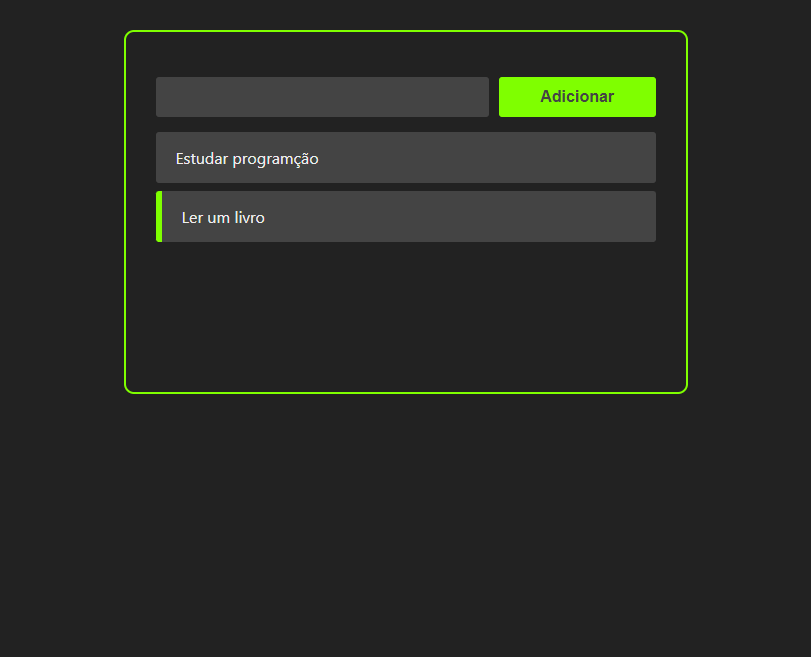

# React Lista de tarefas



> Projeto inicial de React, utilizado para aprender funcionalidades e conceitos para inicialização de um projeto React, de programação funcional e componentes. Esse projeto foi constuido a partir do vídeo do canal do Youtube Felipe Rocha.

## Aprendizados do projeto

- Como instalar React;
- Inicializar servidor local para desenvolvimento;
- Programação funcional com React;
- Componenentes;
- Instalar packages node no projeto.

## Passo a passo para a construção do projeto.

## 🚀 Instalando <react-todo-list>

Para instalar o <react-todo-list>, segui estas etapas:

```
npx install create-react-app <nome do diretório>

npm start

```

-- Utilizado no projeto o pacote node "uuid". O pacote tem a funcionalidade de criar ID aleatórios para não precisar utilizar o Math.random();

## 📫 Contribuindo para <nome_do_projeto>

<!---Se o seu README for longo ou se você tiver algum processo ou etapas específicas que deseja que os contribuidores sigam, considere a criação de um arquivo CONTRIBUTING.md separado--->

Para contribuir com <react-todo-list>, siga estas etapas:

1. Bifurque este repositório.
2. Crie um branch: `git checkout -b <main>`.
3. Faça suas alterações e confirme-as: `git commit -m '<contributing react-todo-list>'`
4. Envie para o branch original: `git push origin <react-todo-list>`
5. Crie a solicitação de pull.

Como alternativa, consulte a documentação do GitHub em [como criar uma solicitação pull](https://help.github.com/en/github/collaborating-with-issues-and-pull-requests/creating-a-pull-request).

## 📝 Licença

Esse projeto está sob licença. Veja o arquivo [LICENÇA](LICENSE.md) para mais detalhes.
